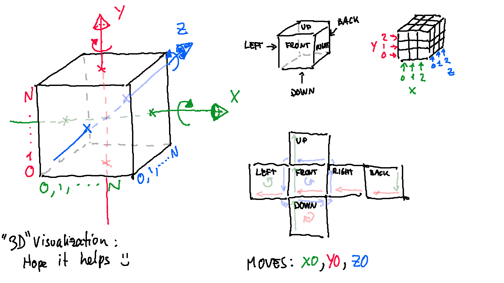

# Qubes
A small, simple and not well optmized python library to tinker with rubiks cubes of any size.
## How to use
Create a standard 3x3x3 cube:
```python
cube = Cube()
print(cube) #Should print out the cube colored and well formatted!
```
To create a NxNxN cube you can simply provide N-2 as the constructor argument:
```python
N = 10 #whatever you like
cube = Cube(N - 2)
```
**Note** : Will probably remove the need for the -2 in future update...

Moves are identifies by a string of 2 characters:  The first character identifies the rotation axis.  
The second character identifies the row/column to rotate.  
Example : ```'X0'``` or ```'Y2'```  
You can have a list of all possible move names :
```python
cube = Cube()
print(cube.move_names)
```
To make a move you can use the following method:
```python
cube = Cube()
cube.move('X0') #Applies the X0 move to the cube 1 time
cube.move('Z2', 3) #Applies the Z2 move to the cube 2 times
cube.move('Y1', -2) #Applies the Y1 move to the cube 2 times in the opposite direction
```
You can also define an entire moveset and then apply it to the cube.  
A moveset is defined as a list of tuples of this form : (move, amount).  
Example:
```python
[('X0', 1), ('Y0', 1), ('Z2', 3)]
```
The method ```cube.apply_moveset(moveset) ``` applies the moveset to the cube.

### Hope this may help

